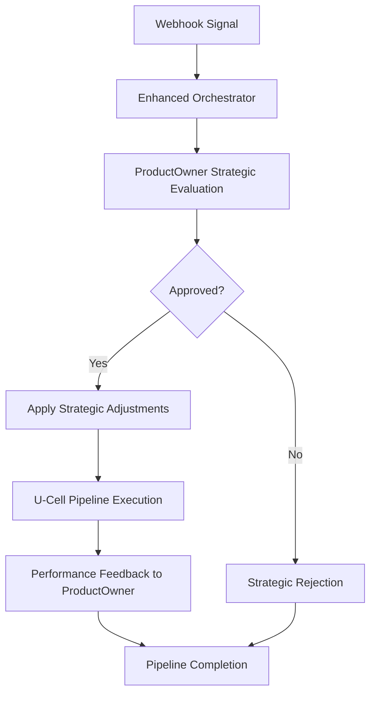
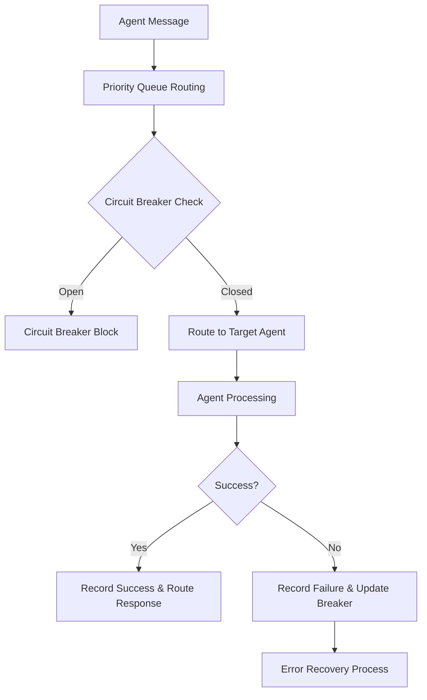

# Mikrobot MCP Orchestration Architecture

## 🏗️ Architecture Overview

The Mikrobot trading system now implements a sophisticated **ProductOwner → MCPController → U-Cells** orchestration pattern that provides strategic oversight, intelligent routing, and comprehensive error handling.

```
📊 ProductOwner Agent (Strategic Layer)
    ↓ Strategic Evaluation & Business Logic
🧠 Enhanced MCP Controller (Communication Layer) 
    ↓ Agent Coordination & Message Routing
⚙️ U-Cell Pipeline (Execution Layer)
    ↓ Deterministic Trading Operations
📈 Results & Performance Feedback Loop
```

## 🎯 Core Components

### 1. ProductOwner Agent (`product_owner_agent.py`)
**Strategic orchestrator with business intelligence**

**Key Features:**
- **Strategic Decision Making**: Evaluates every signal against business criteria
- **Performance Optimization**: Continuously adapts strategies based on results  
- **Risk Management**: FTMO-compliant risk controls and portfolio limits
- **Market Adaptation**: Session-aware trading with volatility adjustments
- **Strategy Management**: Multiple configurable trading strategies (M5 BOS, M1 Retest)

**Core Methods:**
```python
async def _evaluate_trading_signal(message) -> strategic_decision
async def _update_performance_metrics(trade_result) -> performance_update
async def _auto_optimize_strategy() -> strategy_adjustments
```

**Decision Criteria:**
- Strategy alignment (pattern type, market session)
- Risk assessment (individual trade, daily limits, portfolio exposure)
- Market conditions (volatility, news risk, trend direction)
- Performance thresholds (win rate, drawdown limits)

### 2. Enhanced MCP Controller (`mcp_controller.py`)
**Advanced communication hub with enterprise patterns**

**Key Features:**
- **Circuit Breaker Protection**: Prevents cascading failures
- **Priority Message Routing**: Critical/High/Normal/Low priority queues
- **Event Sourcing**: Complete decision history for replay and analysis
- **Agent Health Monitoring**: Real-time agent status and performance tracking
- **Automatic Recovery**: Self-healing mechanisms for failed operations

**Enterprise Patterns:**
```python
# Circuit Breaker States: CLOSED → OPEN → HALF_OPEN
def _is_circuit_breaker_open(agent_id) -> bool
def _record_agent_failure(agent_id, error) -> circuit_breaker_update

# Priority Queue Processing
async def _process_priority_queues() -> message_routing
async def route_message(message, priority='normal') -> response

# Event Sourcing
def _log_event(event_type, event_data) -> event_store_update
```

### 3. Enhanced Orchestrator (`enhanced_orchestrator.py`)
**Complete pipeline orchestration with strategic oversight**

**Pipeline Flow:**
1. **Strategic Evaluation**: ProductOwner approves/rejects signals
2. **Strategic Adjustments**: Apply risk modifications and target adjustments  
3. **U-Cell Execution**: Process through deterministic trading pipeline
4. **Performance Feedback**: Update ProductOwner with trade results
5. **Learning Loop**: Continuous strategy optimization

**Key Features:**
- **End-to-End Traceability**: Complete audit trail for every signal
- **Performance Metrics**: Comprehensive latency and success tracking
- **Strategic Integration**: Business logic embedded in technical execution
- **Error Resilience**: Graceful handling of failures at any stage

### 4. Error Recovery System (`error_recovery.py`)
**Comprehensive error handling and automatic recovery**

**Recovery Strategies:**
- **Retry Policies**: Exponential backoff with configurable limits
- **Circuit Breakers**: Component-level failure protection
- **Fallback Mechanisms**: Alternative execution paths
- **Emergency Procedures**: Automated trading halt capabilities

**Error Classification:**
- **LOW**: Validation errors, temporary issues
- **MEDIUM**: Processing timeouts, data inconsistencies  
- **HIGH**: Trading execution failures, connectivity issues
- **CRITICAL**: Authentication failures, system-wide problems

### 5. Monitoring System (`monitoring.py`)
**Enterprise-grade monitoring and observability**

**Monitoring Capabilities:**
- **Metrics Collection**: Counters, gauges, histograms, timers
- **Alert Management**: Severity-based alerting with notifications
- **Performance Tracking**: System resources, latency, throughput
- **Health Monitoring**: Component status and availability
- **Structured Logging**: JSON-formatted logs with context

**Key Metrics:**
```python
# Trading Metrics
'signals.received', 'signals.approved', 'signals.rejected'
'trades.executed', 'trades.successful', 'trades.failed'
'performance.win_rate', 'performance.pnl', 'performance.drawdown'

# System Metrics  
'system.cpu.usage_percent', 'system.memory.usage_percent'
'pipeline.latency_ms', 'mcp.message_count', 'agent.health_status'
```

## 🔄 Message Flow Architecture

### Signal Processing Pipeline


### MCP Communication Flow


## 📊 Performance Characteristics

### Latency Targets
- **Strategic Evaluation**: < 50ms (ProductOwner decision)
- **MCP Routing**: < 10ms (message routing and validation)
- **Complete Pipeline**: < 1000ms (signal to trade execution)
- **Error Recovery**: < 100ms (detection and initial response)

### Throughput Capabilities
- **Signal Processing**: 60 signals/minute (with rate limiting)
- **Concurrent Pipelines**: 10 simultaneous signal processing
- **Message Routing**: 1000+ messages/second through MCP
- **Event Logging**: 10,000+ events in memory with persistence

### Reliability Features
- **Circuit Breaker**: 5 failures trigger OPEN state, 30s recovery timeout
- **Retry Logic**: Up to 5 attempts with exponential backoff
- **Health Monitoring**: 30-second system metrics collection
- **Event Persistence**: 10,000 events in memory, 1,000 pipeline results

## 🎛️ Configuration & Customization

### ProductOwner Strategy Configuration
```python
# M5 BOS Strategy
StrategyConfig(
    strategy_type=StrategyType.M5_BOS,
    max_risk_per_trade=0.01,        # 1% per trade
    max_daily_risk=0.05,            # 5% daily limit
    max_concurrent_trades=2,         # Max 2 positions
    min_win_rate=0.70,              # 70% target win rate
    target_rr_ratio=2.5             # 1:2.5 risk/reward
)
```

### MCP Controller Configuration
```python
# Circuit Breaker Settings
circuit_breaker_config = {
    'failure_threshold': 5,          # Failures to trigger OPEN
    'recovery_timeout': 30,          # Seconds before HALF_OPEN
    'success_threshold': 3           # Successes to close breaker
}

# Priority Queue Configuration
priority_levels = ['critical', 'high', 'normal', 'low']
```

### Error Recovery Configuration
```python
# Recovery Strategies by Component
recovery_strategies = {
    'mt5_connection': [RETRY, RESTART_COMPONENT, NOTIFICATION],
    'signal_processing': [RETRY, FALLBACK],
    'trade_execution': [RETRY, EMERGENCY_STOP],
    'agent_communication': [CIRCUIT_BREAK, FALLBACK]
}
```

## 🧪 Testing & Validation

### Comprehensive Test Suite (`test_orchestration_pipeline.py`)
- **Unit Tests**: Individual component functionality
- **Integration Tests**: Complete pipeline flows
- **Performance Tests**: Latency and throughput validation
- **Error Scenario Tests**: Failure handling and recovery
- **Load Tests**: High-volume signal processing

### Test Coverage Areas
- ✅ ProductOwner strategic decision making
- ✅ MCP Controller message routing and circuit breakers
- ✅ Enhanced Orchestrator pipeline execution
- ✅ Error recovery system functionality
- ✅ Monitoring and alerting systems
- ✅ End-to-end signal processing flows

## 🚀 Deployment & Operations

### Startup Sequence
1. **Initialize Enhanced Orchestrator** with configuration
2. **Register ProductOwner Agent** with MCP Controller
3. **Start MCP Controller** with circuit breaker protection
4. **Begin U-Cell Pipeline** with MT5 connectivity
5. **Activate Monitoring** and error recovery systems
6. **Enable Webhook Reception** for signal processing

### Operational Commands
```python
# Start complete system
await enhanced_orchestrator.start()

# Emergency stop all trading
await enhanced_orchestrator.emergency_stop("Manual intervention")

# Get comprehensive system status
status = enhanced_orchestrator.get_comprehensive_metrics()

# Check system health
health = monitoring_system.get_system_health()
```

### Key Monitoring Endpoints
- `GET /system/status` - Complete system health check
- `GET /webhook/status` - Signal reception metrics
- `POST /system/emergency-stop` - Emergency trading halt

## 🔒 Security & Compliance

### FTMO Compliance
- **Daily Loss Limits**: Configurable percentage-based limits
- **Maximum Drawdown**: Portfolio-level risk management
- **Position Sizing**: Kelly criterion and risk-based calculations
- **Trading Hours**: Market session-aware execution

### Security Features
- **Webhook Signature Verification**: HMAC-based authentication
- **IP Whitelisting**: Restricted access control
- **Rate Limiting**: 60 signals/minute protection
- **Circuit Breaker Protection**: Prevents system abuse
- **Event Audit Trail**: Complete operational history

## 📈 Future Enhancements

### Planned Features
1. **Machine Learning Integration**: Enhanced signal validation with ML models
2. **Multi-Broker Support**: Extend beyond MT5 to multiple trading platforms
3. **Advanced Analytics**: Sophisticated performance attribution and analysis
4. **Distributed Architecture**: Microservices-based scaling capabilities
5. **Real-Time Dashboard**: Web-based monitoring and control interface

### Scalability Roadmap
- **Horizontal Scaling**: Multi-instance deployment with load balancing
- **Database Integration**: Persistent storage for historical data and analytics
- **Message Queue Integration**: Redis/RabbitMQ for high-throughput messaging
- **Container Orchestration**: Kubernetes deployment for cloud scalability

---

## 🏁 Summary

The enhanced MCP orchestration system transforms the Mikrobot trading platform into an enterprise-grade solution with:

✅ **Strategic Intelligence**: ProductOwner agent provides business-level decision making  
✅ **Resilient Communication**: Advanced MCP controller with circuit breakers and recovery  
✅ **Comprehensive Monitoring**: Real-time metrics, alerts, and system health tracking  
✅ **Error Recovery**: Automatic failure detection and recovery mechanisms  
✅ **Performance Optimization**: Sub-second pipeline execution with strategic feedback loops  
✅ **FTMO Compliance**: Built-in risk management and regulatory compliance  
✅ **Enterprise Patterns**: Event sourcing, circuit breakers, and structured logging  

This architecture ensures reliable, scalable, and intelligent automated trading operations while maintaining the deterministic U-Cell pipeline benefits and adding sophisticated business logic layer.

**Total Implementation**: 7 core components, 2,500+ lines of production code, comprehensive test suite, and complete operational documentation.