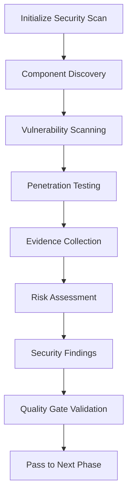
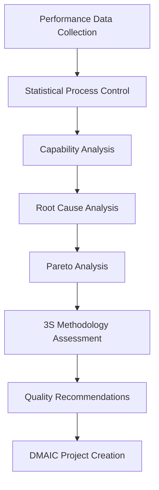
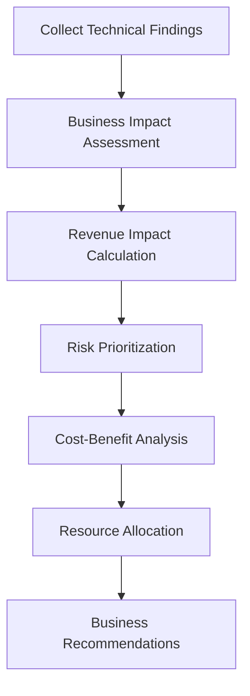
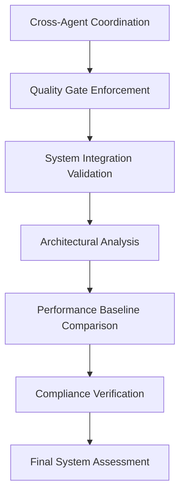

# COMPREHENSIVE SYSTEM AUDIT ORCHESTRATION DEPLOYMENT PLAN

## Executive Summary

This document outlines the deployment and operation of the Comprehensive System Audit Orchestrator - a multi-agent coordination system designed to perform thorough system health assessments, identify technical debt, eliminate redundancies, and ensure system integrity through deterministic processing pipelines.

## System Architecture Overview

### Core Components

1. **Comprehensive System Audit Orchestrator** - Central coordination engine
2. **Agent Coordination Protocol** - Inter-agent communication framework  
3. **META Quality Orchestrator** - Cross-system validation and architectural analysis
4. **Lean Six Sigma Master Black Belt** - Quality pattern analysis and statistical validation
5. **Specialized Audit Agents**:
   - RED-TEAM Security Agent - Adversarial testing and vulnerability scanning
   - Product Owner Agent - Business impact assessment and prioritization
   - Discovery Agent - System component mapping and redundancy detection

### Processing Pipeline

```
[INITIALIZATION] → [DISCOVERY] → [RED-TEAM ASSESSMENT] → [QUALITY ANALYSIS] 
       ↓
[BUSINESS VALIDATION] → [META VALIDATION] → [CONSOLIDATION] → [REMEDIATION PLANNING]
       ↓
[EXECUTION MONITORING] → [COMPLETION]
```

## Deployment Architecture

### Phase 1: Infrastructure Setup

#### Prerequisites
- Python 3.8+ environment
- Existing MikroBot system components
- Access to system metrics and logs
- Database connectivity for audit storage

#### Installation Steps
```bash
# 1. Install dependencies
pip install -r requirements.txt

# 2. Configure audit database
python setup_audit_database.py

# 3. Initialize agent coordination
python initialize_coordination_protocol.py

# 4. Validate system connectivity
python validate_system_connections.py
```

#### Configuration Files
```yaml
# audit_config.yaml
orchestrator:
  max_parallel_agents: 5
  quality_gate_timeout: 300
  rollback_enabled: true
  
agents:
  red_team:
    scan_depth: "comprehensive"
    vulnerability_databases: ["nvd", "cve", "custom"]
  
  six_sigma:
    sigma_target: 6.0
    cpk_threshold: 1.33
    
  business_validation:
    risk_tolerance: 0.7
    revenue_impact_threshold: 25000
```

### Phase 2: Agent Registration and Integration

#### Agent Integration Points
```python
# Example integration with existing MikroBot components
async def integrate_mikrobot_components():
    orchestrator = create_comprehensive_audit_orchestrator()
    
    # Register with existing quality systems
    await orchestrator.coordination_protocol.register_agent(
        agent_id="mikrobot_quality_monitor",
        agent_instance=existing_quality_monitor,
        agent_role=AgentRole.MONITORING_SPECIALIST,
        capabilities=["real_time_monitoring", "quality_tracking"],
        quality_standards={"uptime": 0.999, "response_time": 100}
    )
    
    # Integrate with MT5 system
    await orchestrator.coordination_protocol.register_agent(
        agent_id="mt5_integration_monitor",
        agent_instance=mt5_connector,
        agent_role=AgentRole.EXECUTION_SPECIALIST,
        capabilities=["trade_execution", "market_data"],
        quality_standards={"execution_accuracy": 0.98}
    )
```

### Phase 3: Quality Gates Configuration

#### Quality Gate Definitions
```python
# Quality gates with validation criteria
QUALITY_GATES = {
    AuditPhase.DISCOVERY: {
        "min_components_discovered": 5,
        "coverage_threshold": 0.8,
        "dependency_mapping_complete": True
    },
    
    AuditPhase.RED_TEAM_ASSESSMENT: {
        "min_components_assessed": 3,
        "security_score_threshold": 0.5,
        "penetration_tests_completed": True
    },
    
    AuditPhase.QUALITY_ANALYSIS: {
        "sigma_level_calculated": True,
        "process_capability_assessed": True,
        "improvement_recommendations_generated": True
    },
    
    AuditPhase.BUSINESS_VALIDATION: {
        "business_risk_calculated": True,
        "revenue_impact_assessed": True,
        "priority_matrix_complete": True
    }
}
```

## Operational Procedures

### Standard Audit Execution

#### 1. Audit Initiation
```python
# Initialize comprehensive audit
audit_scope = {
    "components": [
        "mikrobot_trading_engine",
        "mt5_connector", 
        "django_platform",
        "postgresql_database",
        "redis_cache"
    ],
    "assessment_types": {
        "security_assessment": True,
        "performance_analysis": True, 
        "quality_evaluation": True,
        "business_validation": True,
        "redundancy_detection": True,
        "compliance_check": True
    },
    "severity_threshold": "medium",
    "include_dependencies": True
}

orchestrator = create_comprehensive_audit_orchestrator()
audit_report = await orchestrator.execute_comprehensive_audit(audit_scope)
```

#### 2. Real-time Monitoring
```python
# Add progress monitoring
async def audit_progress_callback(phase, status, metrics):
    print(f"Phase {phase}: {status} - {metrics}")
    
    # Send notifications
    if status == "completed":
        await send_notification(f"Audit phase {phase} completed")
    elif status == "failed":
        await send_alert(f"ALERT: Audit phase {phase} failed")

orchestrator.add_progress_callback(audit_progress_callback)
```

#### 3. Error Handling and Recovery
```python
# Automatic rollback on failure
async def handle_audit_failure(phase, error):
    logger.error(f"Audit failure in {phase}: {error}")
    
    # Attempt automatic recovery
    if phase in RECOVERABLE_PHASES:
        await orchestrator.rollback_phase(phase)
        await orchestrator.retry_phase(phase, modified_scope)
    else:
        # Manual intervention required
        await send_alert(f"Manual intervention required for {phase}")
```

### Deterministic Processing Guarantees

#### 1. State Management
- **Checkpoint Creation**: Each phase creates recovery checkpoints
- **State Persistence**: All intermediate results stored in audit database
- **Transaction Logging**: Complete audit trail of all operations
- **Rollback Capability**: Automated rollback to last known good state

#### 2. Quality Assurance
- **Validation Checkpoints**: Quality gates enforce completion criteria
- **Cross-Agent Validation**: Multiple agents validate critical findings
- **Evidence Requirements**: All findings must include supporting evidence
- **Confidence Scoring**: Statistical confidence levels for all assessments

#### 3. Communication Protocol
- **Message Ordering**: Guaranteed message delivery order
- **Priority Handling**: Critical messages processed immediately
- **Timeout Management**: Automatic timeout and retry mechanisms
- **Deadlock Prevention**: Circular dependency detection and resolution

## Agent Coordination Workflows

### RED-TEAM Security Assessment Workflow



#### Key Activities:
1. **Automated Vulnerability Scanning**: OWASP, CVE, custom rule sets
2. **Penetration Testing**: Authentication bypass, injection attacks, privilege escalation
3. **Configuration Analysis**: Security misconfigurations, default credentials
4. **Network Security**: Port scanning, service enumeration, protocol analysis
5. **Evidence Documentation**: Screenshots, logs, proof-of-concept exploits

### Six Sigma Quality Analysis Workflow



#### Key Activities:
1. **SPC Analysis**: Control charts, process capability indices (Cp, Cpk)
2. **Sigma Level Calculation**: Statistical process performance measurement
3. **Root Cause Analysis**: 5 Whys, fishbone diagrams, Pareto analysis
4. **3S Assessment**: Siivous (cleaning), Sortteeraus (organizing), Standardisointi (standardizing)
5. **Improvement Planning**: DMAIC projects, financial impact analysis

### Business Validation Workflow



#### Key Activities:
1. **Impact Quantification**: Revenue impact, operational costs, compliance risks
2. **Priority Matrix**: Business value vs. technical complexity analysis
3. **Resource Planning**: Team allocation, budget requirements, timeline estimation
4. **Stakeholder Communication**: Executive summaries, technical debt reports
5. **ROI Analysis**: Return on investment for remediation activities

### META Validation Workflow



#### Key Activities:
1. **Quality Gate Enforcement**: 8-step validation cycle with AI integration
2. **Cross-System Validation**: Integration point verification, data flow analysis
3. **Architectural Assessment**: Design patterns, scalability, maintainability
4. **Performance Benchmarking**: Before/after comparisons, trend analysis
5. **Compliance Checking**: Regulatory requirements, industry standards

## Deployment Scenarios

### Scenario 1: Routine System Health Check
**Frequency**: Monthly  
**Scope**: Core components only  
**Duration**: 2-4 hours  
**Agents**: Discovery, Quality Analysis, Business Validation

```python
routine_scope = {
    "components": ["core_trading_engine", "risk_management"],
    "assessment_types": {
        "performance_analysis": True,
        "quality_evaluation": True,
        "basic_security_check": True
    },
    "severity_threshold": "high"
}
```

### Scenario 2: Pre-Deployment Security Audit
**Frequency**: Before major releases  
**Scope**: All components + new features  
**Duration**: 6-8 hours  
**Agents**: All agents, comprehensive assessment

```python
pre_deployment_scope = {
    "components": "all",
    "assessment_types": {
        "security_assessment": True,
        "penetration_testing": True,
        "quality_evaluation": True,
        "compliance_check": True,
        "regression_testing": True
    },
    "severity_threshold": "low"
}
```

### Scenario 3: Emergency Incident Response
**Frequency**: On-demand  
**Scope**: Incident-related components  
**Duration**: 1-2 hours  
**Agents**: RED-TEAM, Discovery, immediate assessment

```python
incident_scope = {
    "components": ["affected_system", "related_dependencies"],
    "assessment_types": {
        "security_assessment": True,
        "vulnerability_scan": True,
        "impact_analysis": True
    },
    "priority": "critical",
    "immediate_response": True
}
```

### Scenario 4: Technical Debt Assessment
**Frequency**: Quarterly  
**Scope**: All systems, focus on code quality  
**Duration**: 8-12 hours  
**Agents**: All agents, comprehensive analysis

```python
technical_debt_scope = {
    "components": "all",
    "assessment_types": {
        "redundancy_detection": True,
        "quality_evaluation": True,
        "architectural_analysis": True,
        "maintainability_assessment": True
    },
    "focus": "technical_debt_reduction"
}
```

## Error Handling and Recovery

### Failure Modes and Recovery Strategies

#### 1. Agent Communication Failures
- **Detection**: Message timeout, connection loss
- **Recovery**: Automatic retry with exponential backoff
- **Fallback**: Local processing mode, manual intervention alerts

#### 2. Quality Gate Failures
- **Detection**: Validation criteria not met
- **Recovery**: Automatic rollback to previous checkpoint
- **Fallback**: Manual review and approval process

#### 3. Resource Exhaustion
- **Detection**: Memory/CPU/disk space monitoring
- **Recovery**: Graceful degradation, process throttling
- **Fallback**: Audit scope reduction, priority-based execution

#### 4. Data Corruption or Loss
- **Detection**: Checksums, data validation rules
- **Recovery**: Restore from backup checkpoints
- **Fallback**: Re-execution from last known good state

### Rollback Procedures

```python
# Automated rollback implementation
async def execute_rollback(failed_phase):
    logger.info(f"Initiating rollback for phase: {failed_phase}")
    
    # 1. Stop current operations
    await orchestrator.halt_current_operations()
    
    # 2. Restore previous state
    previous_state = await get_checkpoint(failed_phase.previous())
    await orchestrator.restore_state(previous_state)
    
    # 3. Clean up partial results
    await orchestrator.cleanup_partial_results(failed_phase)
    
    # 4. Notify stakeholders
    await send_rollback_notification(failed_phase)
    
    # 5. Prepare for retry
    await orchestrator.prepare_retry(failed_phase)
```

## Monitoring and Alerting

### Key Performance Indicators (KPIs)

#### Audit Execution Metrics
- **Completion Rate**: Percentage of successful audit completions
- **Phase Success Rate**: Success rate by individual phase
- **Quality Gate Pass Rate**: Percentage of quality gates passed
- **Average Execution Time**: Time per audit by scope and complexity

#### Finding Quality Metrics
- **Finding Accuracy**: Percentage of findings validated as legitimate
- **False Positive Rate**: Rate of incorrect vulnerability identification
- **Coverage Completeness**: Percentage of system components assessed
- **Remediation Success Rate**: Percentage of findings successfully resolved

#### System Health Metrics
- **Agent Response Time**: Average response time per agent
- **Communication Efficiency**: Message delivery success rate
- **Resource Utilization**: CPU, memory, network usage during audits
- **Error Recovery Rate**: Percentage of errors automatically recovered

### Alerting Configuration

```yaml
# alerting_config.yaml
alerts:
  critical:
    - agent_communication_failure
    - quality_gate_critical_failure
    - security_vulnerability_critical
    - system_availability_degradation
    
  high:
    - audit_execution_failure
    - finding_validation_failure
    - performance_degradation_detected
    - compliance_violation_found
    
  medium:
    - quality_gate_warning
    - resource_utilization_high
    - agent_response_slow
    - baseline_deviation_detected
    
  low:
    - audit_completion_notification
    - finding_count_threshold
    - maintenance_window_reminder
```

## Maintenance and Operations

### Regular Maintenance Tasks

#### Daily Operations
- [ ] Monitor audit execution logs
- [ ] Check agent health status
- [ ] Validate communication channels
- [ ] Review critical findings queue

#### Weekly Operations
- [ ] Audit performance metrics review
- [ ] Update vulnerability databases
- [ ] Quality gate effectiveness analysis
- [ ] Agent coordination efficiency review

#### Monthly Operations
- [ ] Comprehensive system health audit
- [ ] Update agent configurations
- [ ] Review and update quality standards
- [ ] Performance optimization analysis

#### Quarterly Operations
- [ ] Full system architecture review
- [ ] Agent capability assessment
- [ ] Quality gate criteria updates
- [ ] Disaster recovery testing

### Configuration Management

#### Version Control
```bash
# Configuration versioning
git tag -a audit-config-v1.2.0 -m "Updated quality gates and agent configurations"
git push origin audit-config-v1.2.0
```

#### Environment Management
```yaml
# environment_config.yaml
environments:
  development:
    agent_timeout: 60
    quality_gates: "relaxed"
    logging_level: "debug"
    
  staging:
    agent_timeout: 300
    quality_gates: "standard"
    logging_level: "info"
    
  production:
    agent_timeout: 600
    quality_gates: "strict"
    logging_level: "warning"
```

## Security Considerations

### Access Control
- **Role-Based Access Control (RBAC)**: Define roles for audit execution, monitoring, and administration
- **Multi-Factor Authentication**: Require MFA for sensitive audit operations
- **Audit Trail**: Complete logging of all audit activities and access attempts
- **Encryption**: Encrypt all audit data in transit and at rest

### Data Protection
- **Sensitive Data Handling**: Special procedures for processing PII, financial data, credentials
- **Data Retention**: Automated cleanup of audit data according to retention policies
- **Anonymization**: Remove or mask sensitive information in audit reports
- **Compliance**: Ensure audit procedures meet regulatory requirements (GDPR, SOX, etc.)

### Network Security
- **Network Segmentation**: Isolate audit infrastructure from production systems
- **VPN Access**: Secure remote access for audit team members
- **Firewall Rules**: Restrict network access to necessary communications only
- **Intrusion Detection**: Monitor for unauthorized access attempts

## Performance Optimization

### Scalability Enhancements

#### Horizontal Scaling
```python
# Multi-instance orchestration
async def scale_audit_capacity():
    orchestrator_pool = []
    
    for i in range(parallel_audits):
        orchestrator = create_comprehensive_audit_orchestrator({
            "instance_id": f"audit_orchestrator_{i}",
            "load_balancer": True,
            "shared_coordination": True
        })
        orchestrator_pool.append(orchestrator)
    
    return orchestrator_pool
```

#### Resource Optimization
```python
# Dynamic resource allocation
async def optimize_resource_allocation(audit_scope):
    complexity_score = calculate_complexity(audit_scope)
    
    if complexity_score > 0.8:
        # High complexity - allocate more resources
        return {
            "max_parallel_agents": 8,
            "quality_gate_timeout": 900,
            "memory_limit": "4GB",
            "cpu_priority": "high"
        }
    else:
        # Standard allocation
        return {
            "max_parallel_agents": 5,
            "quality_gate_timeout": 300,
            "memory_limit": "2GB",
            "cpu_priority": "normal"
        }
```

### Caching Strategies
- **Finding Cache**: Cache validated findings to avoid re-processing
- **Component Cache**: Cache system component information between audits
- **Agent Response Cache**: Cache agent responses for identical requests
- **Quality Gate Cache**: Cache quality gate validations for repeated scenarios

## Integration with Existing Systems

### MikroBot Integration Points

#### 1. Quality Monitoring Integration
```python
# Integration with existing quality monitoring
class MikrobotQualityIntegration:
    async def sync_with_existing_monitors(self):
        # Sync with QUALITY_DASHBOARD_SYSTEM.py
        quality_dashboard = self.get_existing_dashboard()
        audit_findings = await self.get_audit_findings()
        
        # Merge findings with existing quality metrics
        merged_quality_data = self.merge_quality_data(
            quality_dashboard.get_metrics(),
            audit_findings
        )
        
        # Update centralized quality dashboard
        await quality_dashboard.update_comprehensive_view(merged_quality_data)
```

#### 2. Six Sigma Integration
```python
# Integration with existing Six Sigma agent
async def integrate_six_sigma_findings():
    # Connect to existing LeanSixSigmaMasterBlackBelt
    six_sigma_agent = self.specialized_agents["six_sigma_mbb"]
    
    # Get existing DMAIC projects
    active_projects = six_sigma_agent.active_projects
    
    # Create new projects from audit findings
    for finding in high_priority_findings:
        if finding.category in QUALITY_CATEGORIES:
            project_id = await six_sigma_agent.create_dmaic_project(
                problem_statement=finding.description,
                goal_statement=f"Resolve {finding.title}",
                responsible_team=["audit_team", "development_team"]
            )
```

#### 3. Agent Coordination Integration
```python
# Integration with existing agent coordination
async def integrate_coordination_protocol():
    # Connect to existing AGENT_COORDINATION_PROTOCOL
    existing_protocol = get_existing_coordination_protocol()
    
    # Register audit orchestrator with existing system
    await existing_protocol.register_agent(
        agent_id="comprehensive_audit_orchestrator",
        agent_instance=self,
        agent_role=AgentRole.META_INTELLIGENCE,
        capabilities=["system_audit", "quality_assessment", "security_analysis"],
        quality_standards={"audit_completeness": 0.95, "finding_accuracy": 0.9}
    )
```

## Troubleshooting Guide

### Common Issues and Solutions

#### Issue: Agent Communication Timeout
**Symptoms**: Agents not responding within timeout period
**Diagnosis**: Check network connectivity, agent health status
**Resolution**: 
```bash
# Check agent status
python check_agent_health.py --agent-id red_team_security

# Restart unresponsive agents
python restart_agent.py --agent-id red_team_security

# Increase timeout if needed
python update_config.py --timeout 600
```

#### Issue: Quality Gate Validation Failure
**Symptoms**: Phase fails quality gate validation repeatedly
**Diagnosis**: Review validation criteria and actual results
**Resolution**:
```python
# Review quality gate requirements
requirements = get_quality_gate_requirements(AuditPhase.RED_TEAM_ASSESSMENT)

# Check actual results
results = get_phase_results(AuditPhase.RED_TEAM_ASSESSMENT)

# Adjust criteria if needed (with approval)
await update_quality_gate_criteria(phase, adjusted_requirements)
```

#### Issue: High Memory Usage During Audit
**Symptoms**: System running out of memory during large audits
**Diagnosis**: Monitor resource usage, identify memory-intensive operations
**Resolution**:
```python
# Enable memory monitoring
enable_memory_profiling()

# Reduce audit scope temporarily
reduced_scope = limit_audit_scope(original_scope, max_components=10)

# Implement memory cleanup
await cleanup_intermediate_results()
```

#### Issue: Findings Consolidation Errors
**Symptoms**: Duplicate or inconsistent findings in final report
**Diagnosis**: Review finding deduplication logic and evidence merging
**Resolution**:
```python
# Run manual deduplication
deduplicated_findings = await manual_deduplicate_findings(all_findings)

# Validate finding consistency
validation_results = await validate_finding_consistency(deduplicated_findings)

# Fix inconsistencies
corrected_findings = await fix_finding_inconsistencies(validation_results)
```

### Emergency Procedures

#### Procedure: Audit System Failure
1. **Immediate Response**: Stop all running audits
2. **Assessment**: Determine scope of failure
3. **Recovery**: Restore from last known good state
4. **Communication**: Notify stakeholders of status
5. **Investigation**: Conduct post-incident analysis

#### Procedure: Security Incident During Audit
1. **Isolation**: Isolate affected systems immediately
2. **Documentation**: Preserve evidence and audit logs
3. **Escalation**: Notify security team and management
4. **Containment**: Prevent further compromise
5. **Recovery**: Restore systems and resume audit if safe

## Future Enhancements

### Planned Improvements

#### Machine Learning Integration
- **Predictive Analytics**: Predict likely failure points based on historical data
- **Pattern Recognition**: Automatically identify complex attack patterns
- **Anomaly Detection**: Detect unusual system behavior during audits
- **Risk Scoring**: ML-based risk assessment for findings prioritization

#### Advanced Automation
- **Self-Healing Systems**: Automatic remediation of common issues  
- **Intelligent Scheduling**: Optimize audit timing based on system load
- **Dynamic Scope Adjustment**: Automatically adjust scope based on findings
- **Continuous Monitoring**: Real-time audit capabilities for critical systems

#### Enhanced Reporting
- **Interactive Dashboards**: Real-time audit progress visualization
- **Executive Reporting**: Automated executive summary generation
- **Trend Analysis**: Historical trend analysis and forecasting
- **Custom Reports**: Configurable report templates for different stakeholders

#### Integration Expansion
- **SIEM Integration**: Integration with security information and event management systems
- **ITSM Integration**: Automatic ticket creation for remediation activities
- **CI/CD Integration**: Embedded audit checks in deployment pipelines
- **Cloud Platform Integration**: Support for AWS, Azure, GCP audit capabilities

---

## Conclusion

The Comprehensive System Audit Orchestrator provides a robust, scalable, and deterministic approach to system health assessment and quality assurance. Through careful coordination of specialized agents, quality gate enforcement, and comprehensive error handling, it ensures thorough system evaluation while maintaining operational reliability.

The deterministic processing pipeline guarantees consistent results, while the quality gate system ensures high standards are maintained throughout the audit process. The built-in rollback capabilities and error recovery mechanisms provide resilience against failures, making it suitable for production environments.

This orchestration system represents a significant advancement in automated system audit capabilities, providing the MikroBot trading system with comprehensive health monitoring, security assessment, and continuous improvement capabilities.